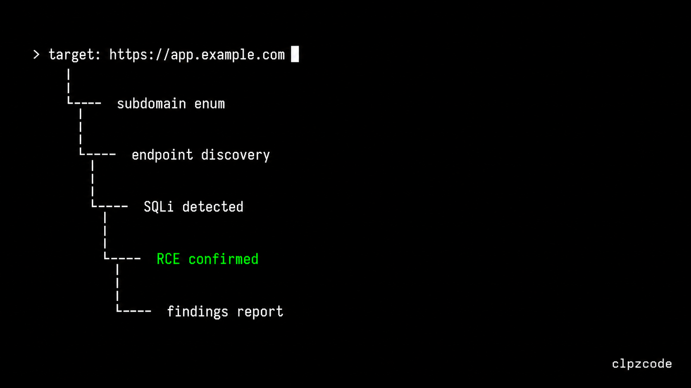
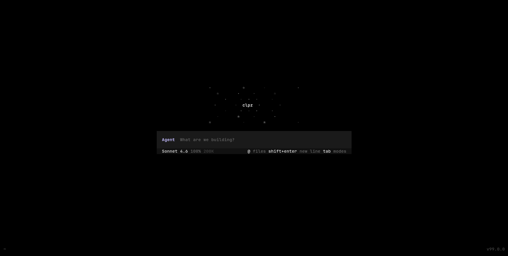
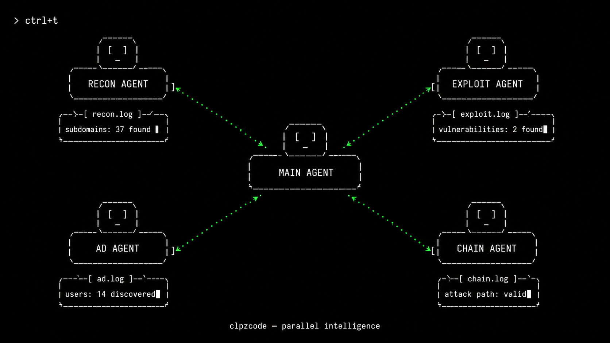
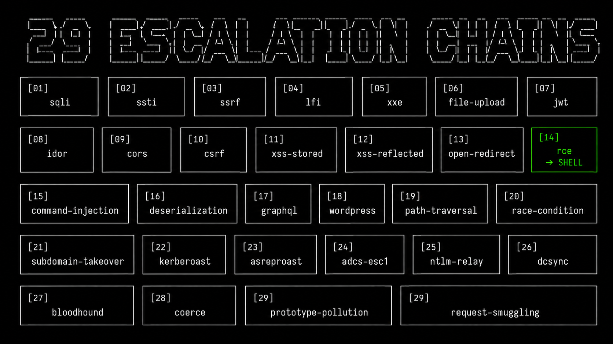
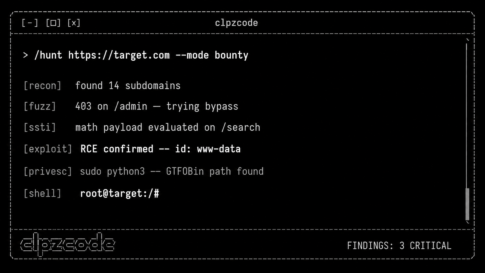
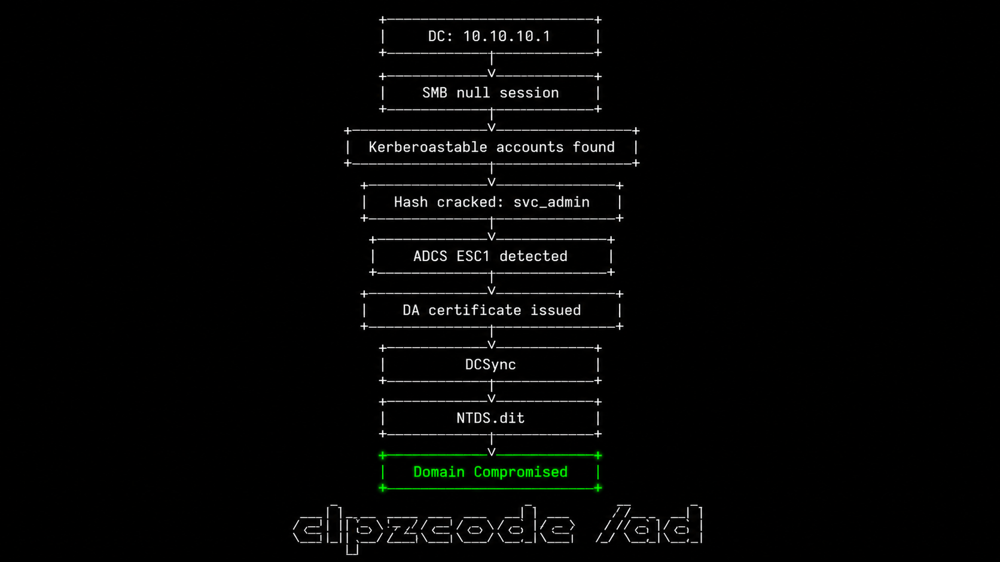

<div align="center">
  
</div>

<br>

<div align="center">

[](https://github.com/clpzbug/clpzcode/tags)
[](LICENSE)
[](https://github.com/clpzbug/clpzcode/issues)

</div>

---

## The idea is simple

<div align="center">
  
</div>

<br>

```
> target: https://app.example.com
```

clpzcode takes it from there. Subdomain enumeration, endpoint discovery, fingerprinting, vulnerability detection, exploitation, privilege escalation chains, findings report. You watch. You intervene when you want.

No scripts to write. No tool chain to orchestrate. Just a target.

---

## What it looks like

<div align="center">
  
</div>

<br>

Minimal. Keyboard-driven. Stays out of your way until there's something worth showing.

---

## What makes it different

**It thinks, not just runs.**
clpzcode uses an AI agent that reads the result of each tool call and decides what to do next. If a SQLi probe returns a 500, it pivots to time-based. If SSTI math evaluates, it escalates to RCE immediately. It chains bugs — finds SSRF, reaches cloud metadata, steals IAM credentials, enumerates S3. It doesn't stop at "found XSS".

**Multi-agent parallelism.**

<div align="center">
  
</div>

<br>

Spawn sub-agents on different models running simultaneously. Recon on one, exploitation on another, AD enumeration on a third — all in parallel. `ctrl+t` shows the live activity tray.

**Any model, any provider.**
Not locked to one API. Run on xAI Grok, local Ollama models, OpenAI, GitHub Models, Gemini, or any OpenAI-compatible endpoint. Switch mid-session with `/model`. No turn cap — runs as long as the job takes.

**29 escalation chains built in.**

<div align="center">
  
</div>

<br>

Every confirmed vulnerability maps to a kill-chain: SSRF → cloud metadata → IAM theft, SQLi → OS shell → privesc, file upload → webshell → lateral movement, ADCS ESC1 → DA cert → DCSync. It knows what to do next.

---

## Commands

<div align="center">
  
</div>

<br>

```bash
# Full autonomous pentest — just give it a target
target: https://app.example.com

# Targeted recon + exploit pipeline
/recon https://app.example.com

# RCE-first attack pipeline
/hunt https://app.example.com --mode bounty

# Targeted exploitation for a known vulnerability class
/exploit https://app.example.com/search?q=test --class ssti

# Escalation chain for a confirmed bug
/chain sqli https://app.example.com/api/users

# Active Directory full pipeline
/ad 10.10.10.1 corp.local

# Audit your own code for vulnerabilities
/security-review

# View session diagnostics
/weakpoints
```

---

## Active Directory

<div align="center">
  
</div>

<br>

`/ad` runs the full pipeline automatically: SMB null session → user enumeration → Kerberoasting → ADCS ESC1/ESC8 → DA certificate → DCSync → NTDS.dit. Give it a DC IP and a domain, it maps the path to compromise.

---

## The attack pipeline

```
1. Subdomain enumeration
        ↓
2. Endpoint discovery + crawl
        ↓
3. Technology fingerprinting
        ↓
4. Vulnerability detection (29 classes in parallel)
        ↓
5. Confirmed finding? → Exploitation attempt
        ↓
6. Shell / credential access? → Privilege escalation
        ↓
7. Lateral movement + post-exploitation
        ↓
8. Findings report with exact reproduction steps
```

Each step feeds the next. It doesn't wait for you between phases.

---

## vs Claude Code

| | clpzcode | Claude Code |
|---|---|---|
| **Provider** | Any LLM | Anthropic only |
| **Pentest commands** | `/exploit` `/ad` `/chain` `/recon` `/hunt` | None |
| **Attack chains** | 29 built-in escalation paths | None |
| **Turn limit** | Unlimited | Hard cap |
| **Multi-agent** | Parallel sub-agents, different models | Single model |
| **Local models** | Full Ollama support | None |
| **Activity tray** | `ctrl+t` live agent/shell view | None |
| **Autonomous mode** | Full pipeline from one target URL | Not designed for it |

---

## Supported providers

| Provider | Setup |
|---|---|
| xAI Grok | `export XAI_API_KEY=your_key` or `/login xai` |
| OpenAI | `export OPENAI_API_KEY=your_key` |
| Ollama (local) | Run `ollama pull llama3`, no key needed |
| GitHub Models | `/login github` |
| Gemini | `export GEMINI_API_KEY=your_key` |
| Any OpenAI-compatible | `/provider` → set base URL + key |

---

## Install

```bash
# npm
npm install -g @clpz/clpzcode

# or build from source
git clone https://github.com/clpzbug/clpzcode
cd clpzcode
bun install && bun run build
./bin/clpzcode
```

**Requirements:** Bun ≥ 1.1 or Node.js ≥ 18

---

## Docs

**Install guides:**
- [Linux](docs/install-linux.md)
- [macOS](docs/install-macos.md)
- [Windows](docs/install-windows.md)

**Advanced:**
- [Advanced setup](docs/advanced-setup.md)
- [Local models via LiteLLM](docs/litellm-setup.md)
- [Hook chains](docs/hook-chains.md)

---

<div align="center">
Built for bug bounty hunters and security researchers.<br>
Only use on targets you are authorized to test.
</div>
